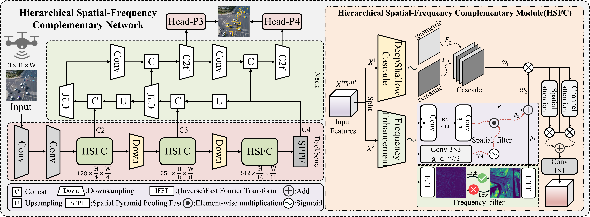

<h2 align="center">
  HSCNet: Hierarchical Spatial-Frequency Complementary Network <br> for Lean UAV Image Object Detection
</h2>

<p align="center">
    <a href="https://github.com/CQNU-ZhangLab/HSCNet/blob/main/LICENSE">
        
    </a>
    <a href="https://github.com/CQNU-ZhangLab/HSCNet/pulls">
        
    </a>
    <a href="https://github.com/CQNU-ZhangLab/HSCNet/issues">
        
    </a>
    <a href="https://github.com/CQNU-ZhangLab/HSCNet">
        
    </a>
    <a href="mailto:2023210516058@stu.cqnu.edu.cn">
        
    </a>
</p>

<p align="center">
    HSCNet is a lightweight neural network that combines spatial and frequency domain features for efficient small object detection in UAV imagery. The network uses Fast Fourier Transform to capture high-frequency details that traditional methods miss, while employing an efficiency-driven design to minimize computational overhead. By processing both spatial multi-scale features and frequency components through its HSFC module, HSCNet achieves superior detection performance with significantly fewer parameters than existing approaches, making it ideal for real-time UAV applications where computational resources are limited. 
</p>

---

<div align="center">
  Jun Ni<sup>1</sup>,
  Qibing Qin<sup>2</sup>,
  Zihan Huang<sup>3</sup>,
  Yunfei Zhu<sup>1</sup>, 
  Wei Hu<sup>1</sup>,
  Wenfeng Zhang<sup>1</sup>,
</div>

  
<p align="center">
<i>
1. Chongqing Normal University &nbsp; 2. Weifang University &nbsp; 3. Tsinghua University &nbsp
</i>
</p>

<p align="center">
  📧 Corresponding authors:<br>
  <a href="mailto:wei.workstation@gmail.com">wei.workstation@gmail.com</a> | <a href="mailto:itzhangwf@cqnu.edu.cn">itzhangwf@cqnu.edu.cn</a>
</p>


<p align="center">
<strong>If our work helps your project, please give us a ⭐!</strong>
</p>

<p align="center">
   <br>
  Overview of the <strong>HSCNet</strong> framework. The network is tailored for UAV object detection. (a) <strong>Backbone network</strong> adopts a lightweight design, integrates the Hierarchical Spatial-Frequency Complementary module to achieve dual-domain feature enhancement, and employs an improved downsampling strategy; (b) <strong>Neck network</strong> adopts an Efficiency-Driven design strategy to optimize the feature pyramid structure; <br> (c) <strong>Detection head</strong> corresponds to a simplified dual-layer output.
</p>

<details>
  <summary>
  <font size="+1">Abstract 📄</font>
  </summary>
Small object detection in aerial imagery faces challenges of insufficient pixel representation and complex backgrounds. Existing spatial domain methods have neglected critical texture features in the frequency domain and are constrained by excessive model parameters, thereby limiting their practical applicability. To alleviate these issues, we propose a novel Hierarchical Spatial-Frequency Complementary Network (HSCNet) tailored for efficient UAV object detection. The core innovation lies in the Hierarchical Spatial-Frequency Complementary (HSFC) module, which establishes multi-level explicit correlation mapping between frequency and spatial domains to effectively mitigate background feature confusion. Meanwhile, to address computational complexity challenges, we propose an Efficiency-Driven (ED) model design strategy that significantly compresses model parameters through redesigned downsampling and removal of structural redundancy. E.g., compared to the baseline on the VisDrone dataset, HSCNet-s achieves 13.1% improvement in APs while reducing parameters by 71.4%. 
</details>

## Installation 🛠️
`conda` virtual environment is recommended. 
```
conda create -n HSCNet python=3.9
conda activate HSCNet
pip install -r requirements.txt
pip install -e .
```
## Data Preparation 📦
To train on the VisDrone and UAVDT datasets, you need to organize them in the YOLO format. Follow the steps below to prepare your dataset:
1. **Organize Images:**
    Structure your dataset directories as follows:
    ```shell
    dataset/
    ├── images/
    │   ├── train/
    │   │   ├── image1.jpg
    │   │   ├── image2.jpg
    │   │   └── ...
    │   ├── val/
    │   │   ├── image1.jpg
    │   │   ├── image2.jpg
    │   │   └── ...
    └── labels/
        ├── train/
        │   ├── image1.txt
        │   ├── image2.txt
        │   └── ...
        └── val/
            ├── image1.txt
            ├── image2.txt
            └── ...
    ```
    - **`images/train/`**: Contains all training images.
    - **`images/val/`**: Contains all validation images.
    - **`labels/train/`**: Contains all training labels.
    - **`labels/val/`**: Contains all validation labels.

2. **Update Configuration Files:**

    Modify your [VisDrone.yml](https://github.com/CQNU-ZhangLab/SFFNet/blob/main/ultralytics/cfg/datasets/VisDrone.yaml) or [UAVDT.yml](https://github.com/CQNU-ZhangLab/SFFNet/blob/main/ultralytics/cfg/datasets/UAVDT.yaml)

    ```yaml
    path: # dataset root dir
    train: # train images (relative to 'path')  
    val: # val images (relative to 'path')  
    test: # test images (optional)  
    
    # Your Dataset Classes
    names:
      0: pedestrian
      1: people
      2: bicycle
      3: car
      4: van
      5: truck
      6: tricycle
      7: awning-tricycle
      8: bus
      9: motor

    ```


## Quick validation ✅
```
python val.py
```
## Quick training 🏋️‍♂️
```
python train.py
```
## Acknowledgement 🙏

The code base is built with [ultralytics-YOLOv8](https://github.com/ultralytics/ultralytics).

Thanks for the great implementations! 

## Support 🌟

If our work helps your project, please give us a ⭐!
